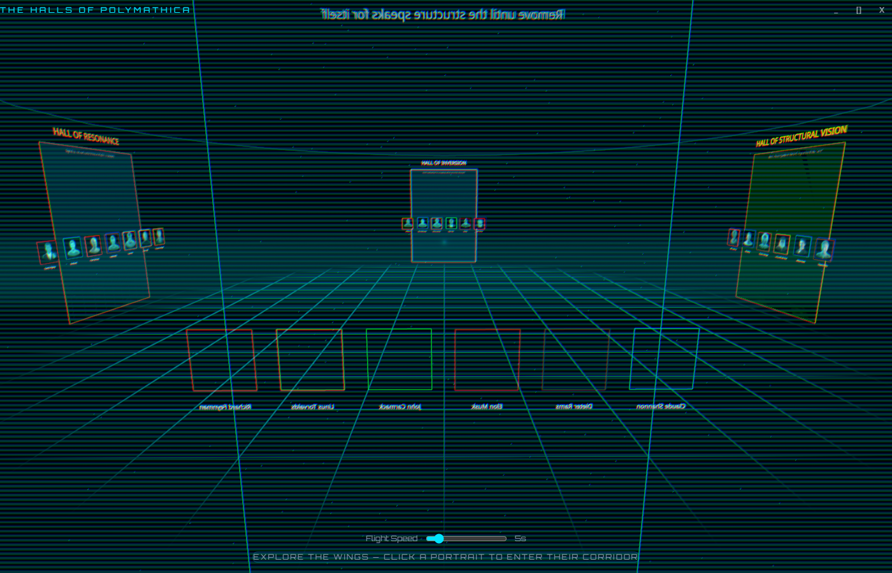
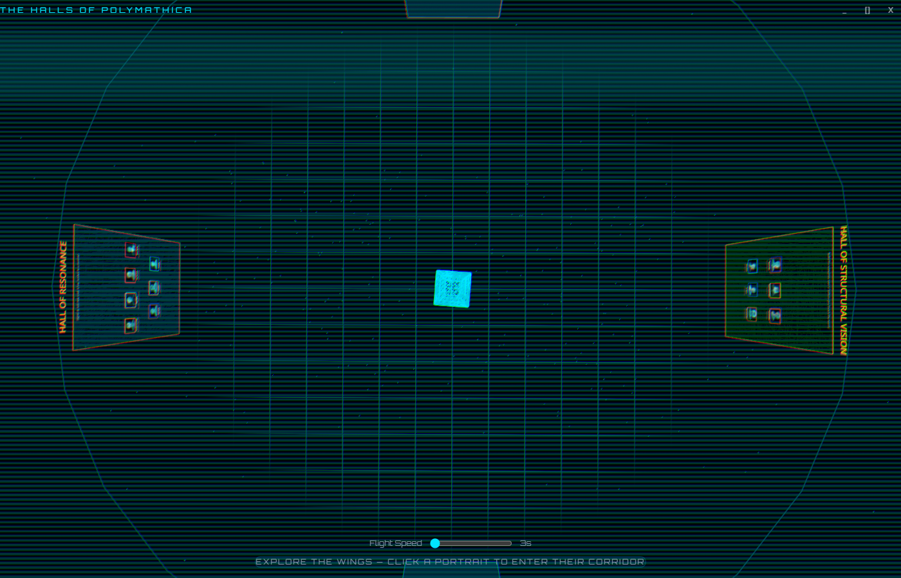
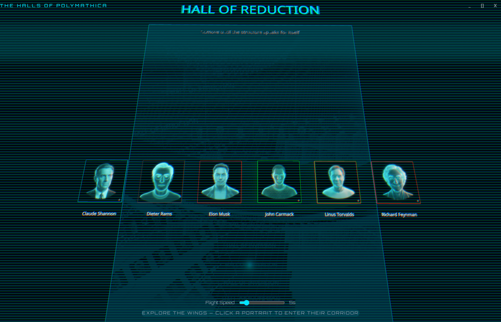
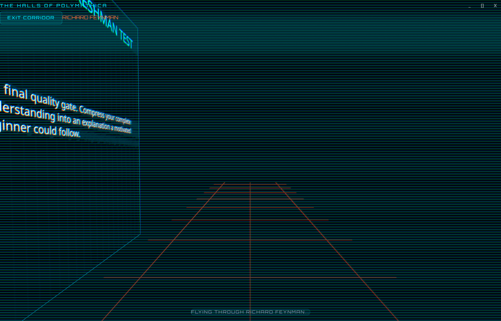
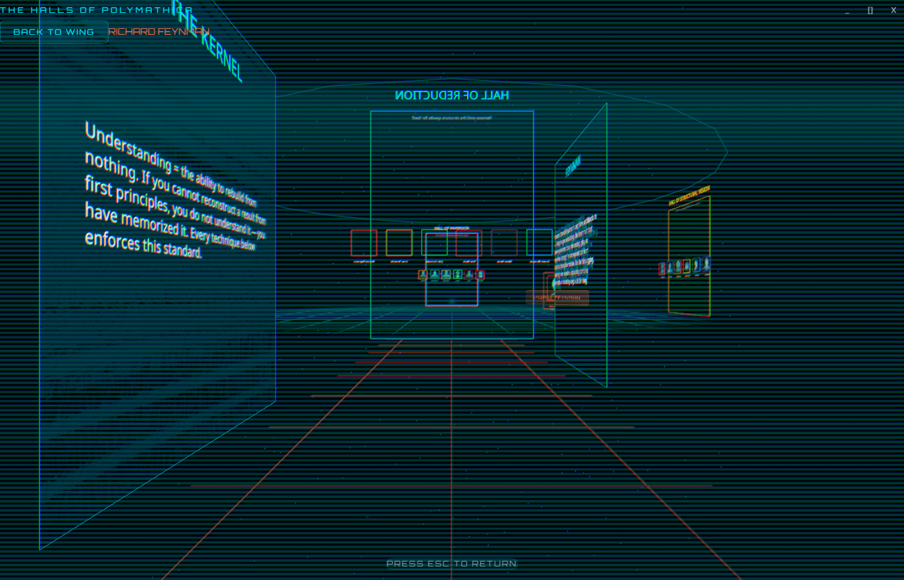

# The Halls of Polymathica

A spatial knowledge environment where you walk through a 3D holographic museum and engage with history's greatest thinkers — each powered by a live Claude Code terminal with their unique cognitive architecture loaded as a system prompt.



## What Is This?

The Halls of Polymathica is a 3D Electron app that turns AI agent prompts into *places you visit*. Instead of selecting from a dropdown, you walk through a holographic rotunda, enter a wing dedicated to a school of thought, fly down a corridor lined with that thinker's methodology, and arrive at their alcove — where a real Claude Code terminal awaits, preloaded with their cognitive architecture.

25 polymathic agents live here. Each one applies a historical figure's thinking patterns as structural constraints on reasoning. They don't roleplay — they *think differently*.

## The Experience

### The Rotunda

A central hub with four wing archways arranged at cardinal points. A settings pedestal sits at the center. WASD to move, mouse to orbit, click a wing card to approach it.



### The Wings

Four wings, each grouped by cognitive mechanism:

| Wing | Direction | Color | Thinkers |
|------|-----------|-------|----------|
| **Hall of Reduction** | North | Cyan | Feynman, Carmack, Shannon, Rams, Musk, Linus |
| **Hall of Structural Vision** | East | Gold | Tesla, da Vinci, Lovelace, Tao, Munger, Gates |
| **Hall of Inversion** | South | White/Blue | Bezos, Sun Tzu, Thiel, Disney, Andreessen, Aurelius |
| **Hall of Resonance** | West | Orange | Jobs, van Gogh, Ogilvy, Godin, MrBeast, Graham, Socrates |

Click a wing card to frame it, then click a portrait to enter their corridor.



### The Corridor

A spline-driven camera flight through the thinker's methodology. Holographic panels on alternating walls reveal their kernel, identity traits, workflow phases, decision gates, and key quotes.



### The Alcove

At the corridor's end: the thinker's portrait, name, and title on a glass wall — with a live terminal below. Click "Engage" to spawn a shell, then click the portrait to launch `claude @<agent-file>` with that polymath's full cognitive architecture.

A "Focus Terminal" button locks all keyboard input to the terminal so Claude Code can receive ESC, WASD, and other keys normally captured by the 3D scene.



## The 25 Polymaths

Each agent file in `agents/` defines a complete cognitive architecture — not a persona, but a *thinking constraint system*. They are read-only consultants: they analyze and advise.

**Code & Architecture** — Carmack, Linus, Tesla, Shannon
**Product & UX** — Jobs, Rams, van Gogh, Disney
**Strategy & Decisions** — Bezos, Thiel, Gates, Andreessen, Sun Tzu, Musk
**Thinking & Analysis** — Feynman, Tao, Munger, Socrates, Lovelace, da Vinci, Aurelius
**Marketing & Content** — Ogilvy, Godin, Graham, MrBeast

## Tech Stack

- **Electron 34** + **electron-vite 3** — Desktop shell with hot reload
- **React 19** + **TypeScript 5** — UI layer
- **React Three Fiber 9** + **drei 10** — 3D scene graph, OrbitControls, Html overlays, GLTF loading
- **Three.js 0.172** — WebGL rendering, CatmullRom spline camera paths
- **xterm.js 5** — Terminal emulator in the browser
- **node-pty** — Real PTY processes (PowerShell/bash)
- **better-sqlite3** — Local database for polymaths, conversations, tags
- **Zustand 5** — Reactive state management
- **Tailwind CSS 4** — Utility styling for HUD overlays
- **Playwright** — 84 e2e tests across 9 spec files

## Prerequisites

- **Node.js** 20+
- **pnpm** 9+
- **Claude Code CLI** installed globally (`npm install -g @anthropic-ai/claude-code`)
- **Windows** (node-pty builds for the current platform)

## Getting Started

```bash
# Clone the repo
git clone https://github.com/your-username/TheHallsOfPolymathica.git
cd TheHallsOfPolymathica

# Install dependencies
pnpm install

# Run in development mode
pnpm run dev

# Build for production
pnpm run build

# Package as installer
pnpm run dist
```

## Controls

| Input | Action |
|-------|--------|
| **W/A/S/D** | Move camera forward/left/back/right |
| **Mouse drag** | Orbit camera |
| **Scroll** | Zoom in/out |
| **Shift + drag** | Pan camera vertically |
| **Click wing card** | Navigate to wing |
| **Click portrait** | Enter corridor (from wing) / Launch Claude (from alcove) |
| **ESC** | Go back one depth level |
| **Focus Terminal** | Lock keyboard to terminal |
| **Release Terminal** | Return keyboard to 3D scene |

## Navigation Depth

```
Rotunda → Wing → Corridor (spline flight) → Alcove (terminal)
   ↑        ↑         ↑                          |
   └────────┴─────────┴──── ESC pops one level ──┘
```

## Project Structure

```
src/
  main/                    # Electron main process
    services/
      pty-manager.ts       # PTY lifecycle management
      session-spawner.ts   # Shell + Claude Code spawning
      agent-content-service.ts  # Parses agent .md files
    db/
      database.ts          # SQLite schema + queries
    polymath-seed.ts       # 25 polymath definitions
  renderer/                # React 3D UI
    features/spatial/
      components/
        RotundaLayout.tsx   # Root scene orchestrator
        Rotunda.tsx         # Floor, dome, archways, pedestal
        Archway.tsx         # Wing card with click-to-navigate
        WingGallery.tsx     # Portrait grid per wing
        Corridor.tsx        # Panels + end wall + terminal
        CameraController.tsx    # WASD + lerp/slerp transitions
        SplineCameraController.tsx  # CatmullRom corridor flight
      store/hallStore.ts    # Zustand navigation state
      constants/
        wings.ts            # 4 wing definitions
        layout.ts           # Dimensions, camera, spacing
    components/
      terminal/TerminalInstance.tsx  # xterm.js wrapper
      SettingsModal.tsx     # Flight speed + terminal display
      HallHUD.tsx           # Breadcrumb nav + settings
  preload/                 # Context bridge (IPC)
agents/                    # 25 polymathic agent prompts
public/
  portraits/               # Holographic portrait PNGs
  models/                  # GLTF models (pedestal)
tests/                     # Playwright e2e specs
```

## Running Tests

```bash
# Unit tests
pnpm run test

# E2E tests (requires build first)
pnpm run build
pnpm run test:e2e

# E2E with visible browser
pnpm run test:e2e:headed
```

## Settings

Click the pedestal in the rotunda center to open the settings modal:

- **Corridor Flight Speed** — How fast the spline camera flies (3–20 seconds)
- **Terminal Scale** — Size of the terminal in 3D space
- **Terminal Width/Height** — Pixel dimensions of the terminal
- **Terminal Y Position** — Vertical placement on the end wall

## Portrait Style

All portraits are cyan holographic wireframe on black — a TRON/Minority Report aesthetic. Generated via AI image models and hand-curated for consistency.

## License

MIT
